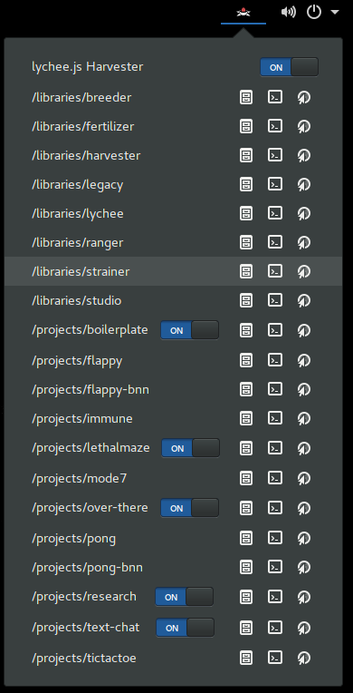

# GNOME Shell Extension for lychee.js Engine


This extension will add a popup menu to your GNOME Shell and integrates
your lychee.js Projects and Libraries with the native operating system.

The extension itself will only use the `lycheejs-*` CLI commands, so
folders, paths etc. are the identical behaviour as the binaries have
in a [lychee.js Engine](https://github.com/cookiengineer/lycheejs)
installation.


# Requirements

- GNOME Shell 3.26.2+
- [lychee.js Engine installation](https://github.com/cookiengineer/lycheejs)
- Management port `4848` (used by lychee.js Harvester)
- HTTP port `8080` (used by lychee.js Harvester)
- lychee.js Harvester's `development` profile (available by default)


Quick Features Overview:

- Start/Stop the lychee.js Harvester from the menu
- Open a terminal session in the lychee.js root

Each Project or Library can be managed:

- Start/Stop project servers from the menu
- Open file manager from the menu
- Open web browser from the menu
- Open a terminal session from the menu





# Installation

You can either copy/paste the contents of the `/source` folder into
the extension path - or use the `PKGBUILD` file on Arch Linux:

Arch Package Installation:

```bash
cd /path/to/gnome-shell-extension-lycheejs;
makepkg -s;
```

Manual installation:

```bash
mkdir -p $HOME/.local/share/gnome-shell/extensions/lycheejs@cookie.engineer;
cd $HOME/.local/share/gnome-shell/extensions/lycheejs@cookie.engineer;

cp -R /path/to/gnome-shell-extension-lycheejs/source/* lycheejs@cookie.engineer/;
```


# Development Help

Use the `[Alt]+[F2]` and `r` trick to restart the GNOME shell.

However, the `console.log()` API that is included with the extension will
work when using `journalctl /usr/bin/gnome-shell -f -o cat` to debug what's
going on. The terminal will stay attached and a GNOME shell restart will
output everything that's going on into the journalctl session.

Sadly, looking glass (the `lg` GNOME command) is a major design
fail when it comes to debugging extensions, because its window
will stay on top and keep the focus, so you cannot do anything
while inspecting the GTK tree.

In order to work with the extension's source code, you can also symlink
the `/source` folder into your local shell extensions like so:

```bash
cd $HOME/.local/share/gnome-shell/extensions;

ln -s /path/to/gnome-shell-extension-lycheejs/source lycheejs@cookie.engineer;
```

