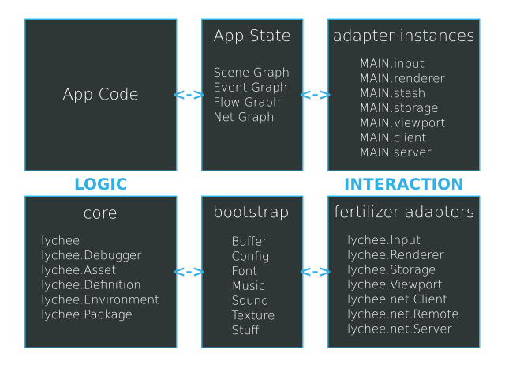

# MAIN Architecture

The `app.Main` instance of each project offers a convenient way
to integrate Platform Adapters with zero lines of platform-specific
code. It can be reused 100% in an isomorphic manner across all
platforms supported by lychee.js.

Remember: The main goal of each Project is to eliminate platform-
specific code as far as possible. Move platform-specific code into
Libraries to have reusable Definitions that can be reused among
multiple Projects.




## App States

Each `lychee.app.State` and `lychee.ui.State` instance has its own
Scene Graph, that means all visible and non-visible Layers and
Entities are structured within `App States`.

```javascript
let main = global.MAIN;

main.__states; // Array of lychee.app.State instances
main.state;    // Active lychee.app.State instance
```

The Serialization concept in lychee.js has a more effective
representation of the Scene Graph by offering a `deserialize(blob)`
API for each App State.

This `deserialize()` method is called by default with the
`attachments["json"]` of each App State.

That means that the `/source/state/Welcome.json` represents all
Layers and Entities that are initially contained in the
`/source/state/Welcome.js` and directly after the
`MAIN.setState('welcome')` call.

```javascript
let main = global.MAIN;

main.setState('welcome', new app.state.Welcome(main));
main.changeState('welcome');

let data = lychee.serialize(main.state);
// data.blob is identical to /source/state/Welcome.json
```

Every App State has an `enter(oncomplete)` and `leave(oncomplete)`
method that is called when the MAIN changes its App State.

By default these enter/leave methods will bind/unbind every event
listeners that are relevant for User Interaction.

Only active App States can receive events by the `lychee.Input`
and `lychee.Viewport` instance and be rendered by the `lychee.Renderer`
instance. The `lychee.app.Main.prototype.changeState(identifier)`
method will handle that automatically for you.


## Adapter Instances

Both the `MAIN` and the `App States` can access all Adapter
Instances. Those Adapter Instances are the abstraction for
platform-specific APIs and have the identical API across all
platforms.

The Platform Adapters in a `lychee.app.Main` instance are
by default completely integrated. If you want to deactivate
an Adapter, you have to set its equivalent `states` entry
to `null`.

So, for example, to deactivate the `lychee.Input` instance,
you will have to set `new app.Main({ input: null })` or
override the defaults in the `/source/app/Main.js` file.

All Platform Adapters are optional. However, if you want to
have a UI-based Application, you have to use at least the
`input`, `renderer`, and `viewport` adapter.

Generic Platform Adapters:

- `(lychee.app.Jukebox) MAIN.jukebox` - a Sound and Music player for queued and parallel playbacks
- `(lychee.app.Loop) MAIN.loop` - an event-firing Loop that simulates, interpolates and predicts update and render flow
- `(lychee.net.Client) MAIN.client` - a peer-to-peer Client for WS13, HTTP1.1/2.0 and TCP
- `(lychee.net.Server) MAIN.server` - a peer-to-peer Server for WS13, HTTP1.1/2.0 and TCP
- `(lychee.Stash) MAIN.stash` - a network-synchronized Filesystem for the Asset API
- `(lychee.Storage) MAIN.storage` - a network-synchronized temporary and permanent Storage

Platform Adapters for User Interaction:

- `(lychee.Input) MAIN.input` - an event-firing Input for Keyboard, Mouse, Touch and Scroll API
- `(lychee.Renderer) MAIN.renderer` - a 2D buffer-capable Renderer
- `(lychee.Viewport) MAIN.viewport` - an event-firing Viewport for Reshape and Orientation Changes

Remember, all Adapter Instances are also accessible in each
App State with the identical property name as in the `MAIN`.


## Example app.Main Definition

```javascript
lychee.define('app.Main').requires([
	'app.state.Welcome'
]).includes([
	'lychee.app.Main'
]).exports(function(lychee, global, attachments) {

	const _app  = lychee.import('app');
	const _Main = lychee.import('lychee.app.Main');


	/*
	 * IMPLEMENTATION
	 */

	const Composite = function(data) {

		let states = Object.assign({
			// XXX: Disabled adapters
			input:   null,
			server:  null,
			storage: null,
			stash:   null,

			// XXX: Enabled adapters
			jukebox: {
				music: true,
				sound: true
			},
			client: {
				host: 'example.com',
				port: 1337
			},
			renderer: {
				id:     'app',
				width:  null,
				height: null
			},
			viewport: {
				fullscreen: false
			}

		}, data);


		_Main.call(this, states);

		states = null;


		/*
		 * INITIALIZATION
		 */

		this.bind('load', function(oncomplete) {
			oncomplete(true);
		}, this, true);

		this.bind('init', function() {
			this.setState('welcome', new _app.state.Welcome(this));
			this.changeState('welcome');
		}, this, true);

	};


	Composite.prototype = {

		// deserialize: function(blob) {},

		serialize: function() {

			let data = _Main.prototype.serialize.call(this);
			data['constructor'] = 'app.Main';


			let states = data['arguments'][0] || {};
			let blob   = data['blob'] || {};

			// XXX: Add differences to lychee.app.Main here

			data['arguments'][0] = states;
			data['blob']         = Object.keys(blob).length > 0 ? blob : null;


			return data;

		}

	};


	return Composite;

});
```

