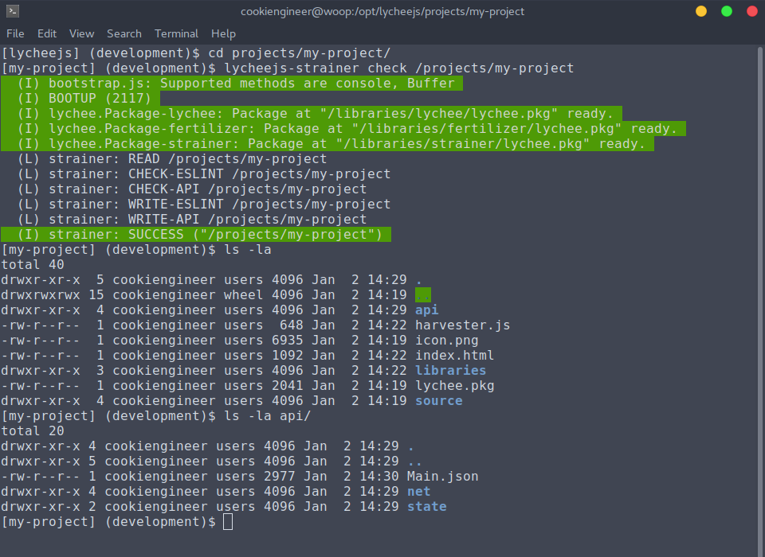

# Workflow

The lychee.js Engine has a specific workflow on
how to create and integrate applications without
manual overhead.

The workflow can be split up in these major phases:

1. Breeding (`init` a project, `pull` a library)
2. Developing (modify a project with your IDE)
3. Fixing (`check` a project)
4. Fertilizing (`configure`, `build`, `package` a project)
5. Publishing (`push` a project)


## 1. Breeding Phase

If you want to create an application, it's easiest
to create a project or library using the
[lychee.js Breeder](../software-bots/lycheejs-breeder.md).

```bash
cd /opt/lycheejs;

mkdir ./projects/my-project;
cd ./projects/my-project;

lycheejs-breeder init;
```


After you've initialized a project, you can directly
start the [lychee.js Harvester](../software-bots/lycheejs-harvester.md)
and it will be fully integrated already.

You can also isolate builds of libraries into your
project, so that the project can be deployed to a
static server.

Remember that each library and project is tracked
as a separate namespace inside the project's `lychee.pkg`
file. Please read the [Package Format](../project-architecture/Package-Format.md)
for more details.

```bash
cd /opt/lycheejs;

cd ./projects/my-project;

lycheejs-breeder pull /libraries/harvester;
```


## 2. Developing Phase

In the developing phase you can freely modify
your project. Remember to always have the
[lychee.js Harvester](../software-bots/lycheejs-harvester.md)
running, so that the software bots can learn from
the project while you code and so that they
can actively help you (and e.g. fix bugs before
they occur).

```bash
cd /opt/lycheejs;

lycheejs-harvester start development;
```

After the lychee.js Harvester is started with
the `development` profile, you can visit
`http://localhost:8080/projects/my-project` to
see the live-view of your project.


## 3. Fixing Phase

The fixing phase is almost always running in
parallel to the developing phase. It can always
be executed, no matter if your project is currently
running a server or not.

Everything in lychee.js (except the core) is
live-updateable and live-injectable at runtime
due to the serialization and sandboxing concept.

The [lychee.js Strainer](../software-bots/lycheejs-strainer.md)
is a tool that helps you to `check` and `stage`
your project, so that every code is linted and
can be understood by our software bots.

```bash
cd /opt/lycheejs;

cd ./projects/my-project;
lycheejs-strainer check /projects/my-project;
```



As you can see in the screenshot, the `lycheejs-strainer`
command automatically parses the API of all definitions
in your project and stores the API knowledge inside the
`/api` folder.

This API format is the one that is used by our Artificial
Intelligence that now tries to understand your codebase
and can give you hints on what went wrong and memorizes
commonly done (and repeatingly done) mistakes while
applying automated bug fixes for you.

If you want to integrate this feature into your IDE, there's
the so-called [lychee.js Strainer Fixer](../software-bots/lycheejs-strainer-fixer.md)
which is a low-level fork of the [lychee.js Strainer](../software-bots/lycheejs-strainer.md)
that can work on a per-file basis and dumps the errors
in a per-file, per-line and per-column format.

```bash
cd /opt/lycheejs;


# This will output errors.
# "0 problems" means everything is fine.
cd ./projects/my-project;
lycheejs-strainer-fixer ./source/Main.js;
```

In IDEs this is the so-called quickfix mode, as the
format is identical to the ones used by most native
compilers.

## 3. Fertilizing Phase

After you are done modifying your project and you want
to create your first build of it, you can use the
[lychee.js Fertilizer](../software-bots/lycheejs-fertilizer.md)
for that purpose.

The lychee.js Fertilizer is an automated build pipeline
that will automatically create all builds for all platforms
for all architectures for you.

```bash
cd /opt/lycheejs;

cd ./projects/my-project;
lycheejs-fertilizer auto /projects/my-project;
```


The reserved `auto` build identifier will automatically
build every `build` environment that is configured in
the project's or library's `lychee.pkg` file.

The build workflow is highly customizable, you can read
more about it in the [lychee.js Fertilizer](../software-bots/lycheejs-fertilizer.md)
chapter.


## 4. Publishing Phase

After you are done modifying your project, you can
make it publicly available for the Artificial Intelligence
cloud called [lychee.js Garden](https://github.com/Artificial-Engineering/lycheejs-garden).

This will make your project or library available to
the public. If you want to have other people's AIs
learning from your code, this is the necessary step
to achieve that.

However, as the AI is modifying and improving your code,
the license will change accordingly to the license as
stated in the [README.md](https://github.com/Artificial-Engineering/lycheejs)
of the lychee.js Engine.

```bash
cd /opt/lycheejs;

cd ./projects/my-project;
lycheejs-breeder push;
```

Now follow the instructions of the `lycheejs-breeder`
wizard to publish your project or library.

