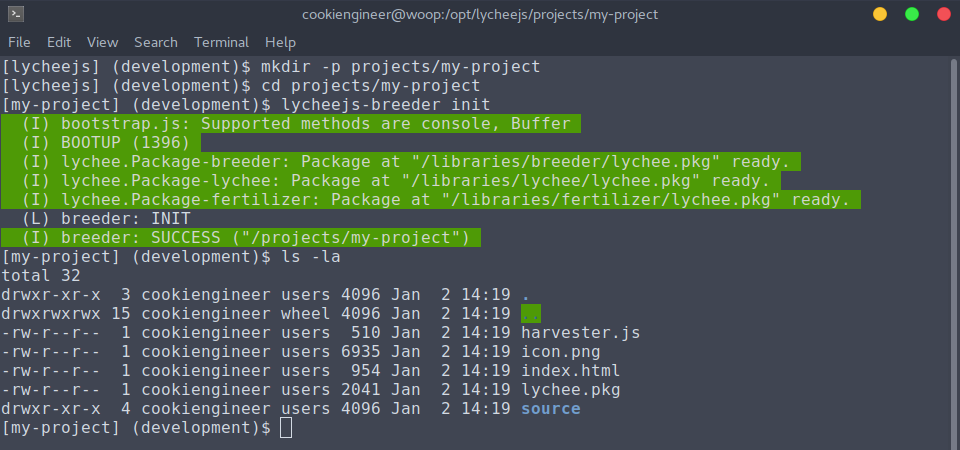
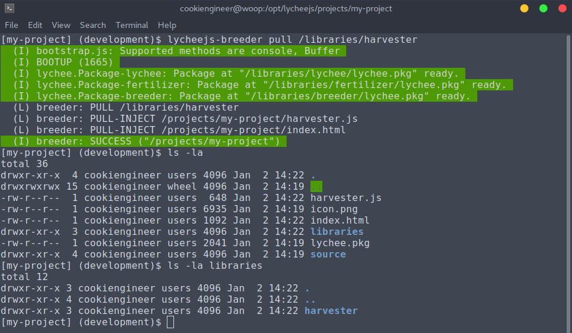

# lychee.js Breeder

The `lycheejs-breeder` is a Command-Line Wizard that helps
to create and manage Projects and Libraries that use the
lychee.js Engine stack.

It can be seen as a wizard that eases up annoying copy/paste
actions and that automates configuration of any kind.

The workflow and how it is used is explained in the
[Workflow](../quickstart/Workflow.md) chapter.


## Initializing a Project

The lychee.js Breeder can be started in the Terminal (bash)
via the `lycheejs-breeder` command.

The `init` action will create a new Project or Library using
the Boilerplate. This new Project is then already fully
integrated into the lychee.js Engine stack, including
peer-to-peer networking support and serialization and
sandboxing features.

The `pull` action will isolate a Library into the Project's
`./libraries` folder so that you can distribute external
dependencies with your Project - e.g. for deployment on
static web servers.

```bash
cd /opt/lycheejs;

lycheejs-breeder; # show help


mkdir -p ./projects/my-project;
cd ./projects/my-project;

lycheejs-breeder init;                   # init a project
lycheejs-breeder pull /libraries/lychee; # pull a library

# (developing phase)
# (fixing phase)
# (fertilizing phase)

lycheejs-breeder push;
```




## Isolating a Library

The lychee.js Breeder can also isolate Libraries into
the Project, so that a static build or deployment is
possible.

```bash
cd /opt/lycheejs;

cd ./projects/my-project;

lycheejs-breeder pull /libraries/harvester; # pull a library
```



All local libraries are stored in the `./libraries` folder
for each project.

If the local libraries folder is not existing, the global
`/opt/lycheejs/libraries` folder will be used as a lookup
for a library.

If you want to revert a pulled library, simply remove the
`./libraries/<identifier>` folder and it will get back
into the defaulted global lookup behaviour.

Note that libraries are typically injected in the `index.html`
or `harvester.js` file. So you have to remove the `require()`
statements or `<script>` elements accordingly afterwards.


## Publishing a Project or Library

The lychee.js Breeder can also publish Libraries and
Projects, so they are publicly available for the Artificial
Intelligence cloud called [lychee.js Garden](https://github.com/Artificial-Engineering/lycheejs-garden).

This will make your project or library available to
the public. If you want to have other people's AIs
learning from your code, this is the necessary step
to achieve that.

However, as the AI is modifying and improving your code,
the license will change accordingly to the license as
stated in the [README.md](https://github.com/Artificial-Engineering/lycheejs)
of the lychee.js Engine.

```bash
cd /opt/lycheejs;

cd ./projects/my-project;
lycheejs-breeder push;
```

Now follow the instructions of the `lycheejs-breeder`
wizard to publish your project or library.

