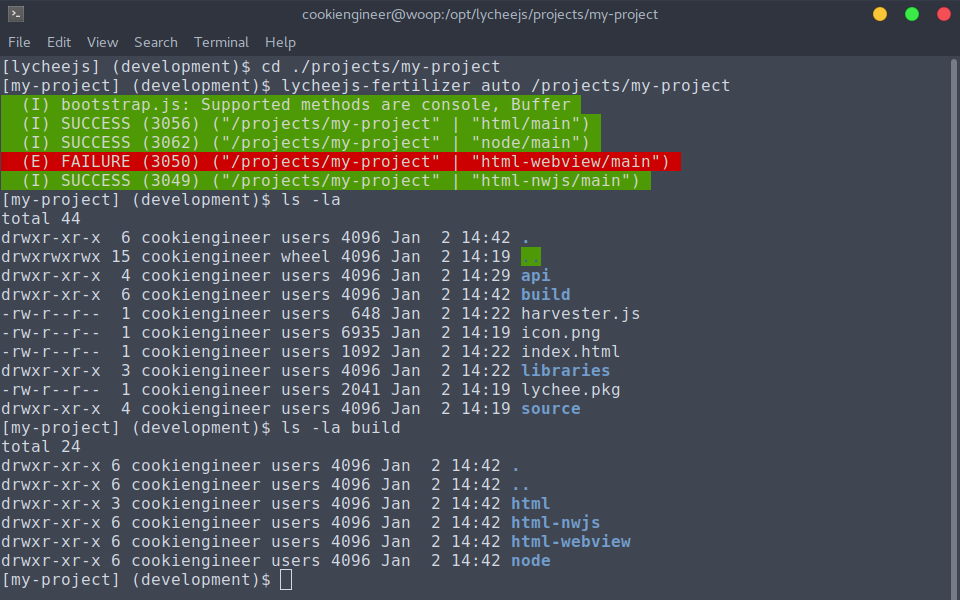

# lychee.js Fertilizer

The `lycheejs-fertilizer` is the build and compiler
toolchain that automates the build and packaging
process of all runtimes behind the scenes.

It features an `auto` mode that automatically builds
every project's and library's environment where those
are defined (as always) in the `lychee.pkg` file.


## Usage

The lychee.js Fertilizer is a bash script, Project
and Library so it is possible to fork it and extend
its capabilities with custom runtimes that are not
yet officially supported by the lychee.js Engine
itself.

When given no arguments, the bash script will show
an overview and examples on specific use cases.

The lychee.js Fertilizer can not only build projects,
but also libraries dependent on environment's `variant`
setting that can either be `application` or `library`.

Everything is sandboxed, so that all dependencies can
properly be guessed with [Feature Detection](../engine-concept/Feature-Detection.md)
and [Feature Prediction](../engine-concept/Feature-Prediction.md)
mechanisms.

In fact, the lychee.js Fertilizer is used to compile
the lychee.js Core and the lychee.js Fertilizer itself
when using the `/opt/lycheejs/bin/configure.sh`.


## Build Flow

The build flow of the lychee.js Fertilizer is divided
in these major steps:

- `configure` configures and serializes the Environment.
- `configure-project` calls the project's `/bin/configure.sh <identifier>`.
- `build` writes all files into the `/build/<identifier>` folder.
- `build-project` calls the project's `/bin/build.sh <identifier>`.
- `package` bundles all platform- and architecture-specific runtimes.
- `package-project` calls the project's `/bin/package.sh <identifier>`.
- `publish-project` publishes the project to a remote server (not triggered automatically).

The project-specific bash scripts are optional. The
advantage of this build flow using a serialization
approach is that everything can be integrated
intelligently with other tools.


## Example Usage

The lychee.js Fertilizer is best used in `auto` mode
as this will build all other environments set up in the
`build/environments` section of the `lychee.pkg` file.

```bash
cd /opt/lycheejs;

cd ./projects/my-project;
lycheejs-fertilizer auto /projects/my-project;
```




## Package Integration

The lychee.js Fertilizer will parse all environments
in the `lychee.pkg` file.

The `auto` target is reserved to offer a mechanism
that automatically builds all environments that are
confgured in the `lychee.pkg` file.

```bash
# Fertilize the Boilerplate with nwjs Runtime
lycheejs-fertilizer html-nwjs/main /projects/boilerplate;

# Fertilize the Boilerplate with ALL Runtimes
lycheejs-fertilizer auto /projects/boilerplate;

# Fertilize the lychee.js Library with ALL Platform Adapters
lycheejs-fertilizer auto /libraries/lychee;
```

All successful builds will be stored in each project's
or library's `./build` folder. The sub structure of
the folder is `./build/<platform>/<identifier>`, so
it's e.g. `./build/html-nwjs/main` in our example.

The `build` folder **MUST NOT** be tracked in git.
It contains binary builds and no manually modified
source code.


## Example Environment

The `lychee.pkg` file by default has already all
important build identifiers setup (as has the
`/projects/boilerplate`).

The important thing to know here is that the
`./build/environments/<identifier>` object is
*identical* to the `lychee.Environment(settings)`.

If you want to have multiple builds with multiple
configurations of your project, use the `profile`
setting to change configurations and modify them
directly in the `lychee.pkg` file.

This example will clear things up on how to
achieve custom configurations of builds:

```json
{
	"api": {
		"files": {}
	},
	"build": {
		"environments": {
			"html-nwjs/main": {
				"build": "app.Main",
				"debug": false,
				"packages": [
					[
						"app",
						"./lychee.pkg"
					]
				],
				"sandbox": false,
				"tags": {
					"platform": [
						"html-nwjs",
						"html"
					]
				},
				"variant": "application",
				"profile": {
					"client": "/api/server/connect?identifier=/projects/my-project",
					"server": "/api/server/connect?identifier=/projects/my-project"
				}
			}
		}
	},
	"source": {
	}
}
```


## Build Customization

Each lychee.js Project and Library can optionally
offer bash scripts that can customize how Apps are
published.

Each custom script must follow the `bash exit code`
rules and echo either `SUCCESS` or `FAILURE`.

- `echo "SUCCESS"; exit 0;` for success case.
- `echo "FAILURE"; exit 1;` for failure case.

Here's an example `/bin/package.sh` file partly taken
from the [mode7](https://github.com/Artificial-Engineering/lycheejs/tree/development/projects/mode7)
Example that integrates custom ZIP files that can
be used for publishing the project later.

```bash
#!/bin/bash

LYCHEEJS_ROOT=$(cd "$(dirname "$(readlink -f "$0")")/../../../"; pwd);
PROJECT_ROOT=$(cd "$(dirname "$(readlink -f "$0")")/../"; pwd);
PROJECT_BUILD="$1";


if [ -d $PROJECT_ROOT/build ]; then

	cd $PROJECT_ROOT;

	if [ "$PROJECT_BUILD" == "html/main" ]; then

		cd "$PROJECT_ROOT/build/$PROJECT_BUILD";
		zip -qr "$PROJECT_ROOT/build/mode7_browser_all.zip" ./*;


		rm -rf "$PROJECT_ROOT/build/$PROJECT_BUILD";

	elif [ "$PROJECT_BUILD" == "html-nwjs/main" ]; then

		cd "$PROJECT_ROOT/build/$PROJECT_BUILD-linux/x86_64";
		zip -qr "$PROJECT_ROOT/build/mode7_linux_x86_64.zip" ./*;
		rm -rf "$PROJECT_ROOT/build/$PROJECT_BUILD-linux";

		cd "$PROJECT_ROOT/build/$PROJECT_BUILD-osx/x86_64";
		zip -qr "$PROJECT_ROOT/build/mode7_osx_x86_64.zip" ./*;
		rm -rf "$PROJECT_ROOT/build/$PROJECT_BUILD-osx";

		cd "$PROJECT_ROOT/build/$PROJECT_BUILD-windows/x86_64";
		zip -qr "$PROJECT_ROOT/build/mode7_windows_x86_64.zip" ./*;
		rm -rf "$PROJECT_ROOT/build/$PROJECT_BUILD-windows";


		rm -rf "$PROJECT_ROOT/build/$PROJECT_BUILD";

	fi;


	echo "SUCCESS";
	exit 0;

else

	echo "FAILURE";
	exit 1;

fi;
```

