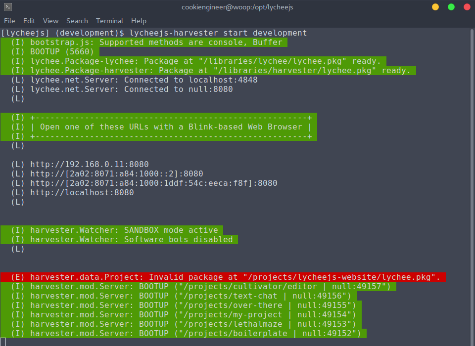

# lychee.js Harvester

The `lycheejs-harvester` is a Continous Integration server
that helps to ease up the development of Projects and Libraries
that use the lychee.js Engine stack.

It can be seen as a webserver and peer-to-peer server that
synchronizes the Artificial Intelligence's knowledge, automates
the build, compile, refactor and packaging pipeline and serves
as a WebSocket server for peers of the Application.

It also integrates the Remote Debugging protocol and the
analytics part of the Artificial Intelligence that helps it
understand what went wrong in case of errors.


## Usage

The lychee.js Harvester can be started in the Terminal (bash)
via the `lycheejs-harvester` command.

```bash
cd /opt/lycheejs;

lycheejs-harvester; # show help

lycheejs-harvester start development; # start development profile
lycheejs-harvester status;            # show whether running (with PID) or not
lycheejs-harvester stop;              # stop

lycheejs-harvester start development --sandbox; # start in sandbox mode
```




### Actions

The lychee.js Harvester should be run in one instance per
machine. If more instances are required, try out the downstream
fork [lycheejs-harvester](https://github.com/Artificial-Engineering/lycheejs-harvester)
that can be run on a per-folder basis.

- `start <profile>` starts a server with the given profile.
- `status` shows if a server is already running (e.g. `Running (1337)`) or not (`Not running`).
- `stop` stops a server (if any server is active).


### Flags

The sandbox mode can be seen as the `development` mode, as it
prevents the software bots from synchronizing broken / unstable
code to the peer cloud and disables the automated build, compile
and refactor pipeline.

- `--debug` enables debug mode and shows more debug messages.
- `--sandbox` enables sandbox mode and disables integration with the Software Bots.


## Profiles

The defaulted profiles are `development` and `production`.

Another example profile is also available, which shows the
custom setup of the `artificial.engineering` website.

All profiles are also available in the filesystem. The folder
where profiles are stored in is `/opt/lycheejs/bin/harvester`.

For example, the `development` profile is stored in the file
`/opt/lycheejs/bin/harvester/development.json`.

Each profile's file consists of a JSON structure that has these
settings and properties:

```javascript
{
	"host":    "localhost", // host of server
	"port":    8080,        // port of server
	"debug":   false,       // enables debug mode
	"sandbox": true         // enables sandbox mode
}
```

