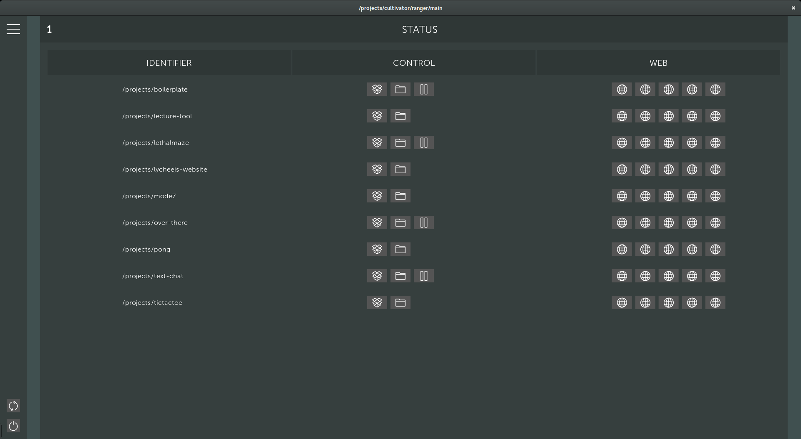
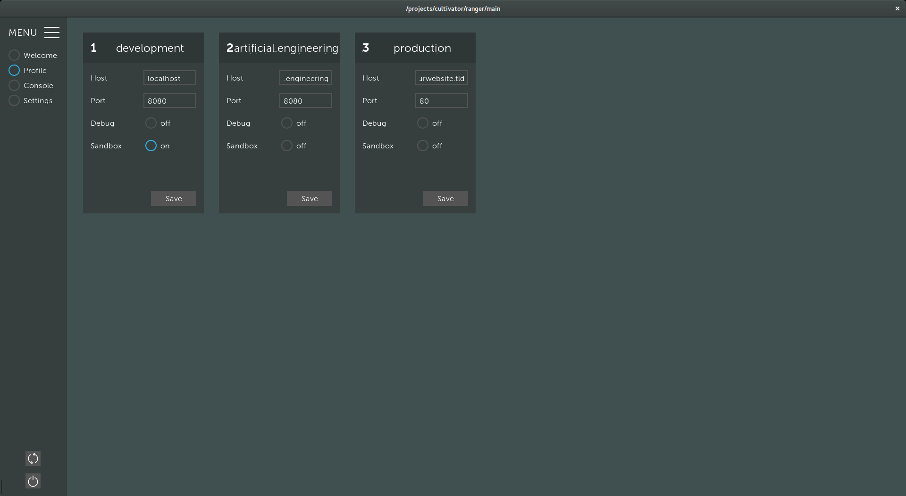

# lychee.js Ranger

The `lycheejs-ranger` is graphical Tool that helps
you manage any lychee.js Harvester installation.

It can modify and set profiles, reboot every project-
and library-specific server and the Harvester itself.


## Usage

The lychee.js Ranger can be started via the Desktop
Applications entry or the `lycheejs-ranger` command.

If you want to connect to a foreign server that is
not your local machine, you can tunnel the connection
through SSH:

```bash
ssh -L 4848:localhost:4848 user@public-server.tld
```

For security reasons, the Harvester only listens on
`localhost` on the management port `4848`, so that
no public access is possible.


## Project Management

The lychee.js Ranger allows to manage all Projects
and Libraries.

The Welcome State offers common functionalities.

- `open` Button opens the Project in [lychee.js Studio](./lycheejs-studio.md).
- `folder` Button opens the Project in the File Manager.
- `start/stop` starts and stops the Project server (`harvester.js` file).
- `web` Buttons open the Web Browser at different Web Hosts (`ipv4` and `ipv6`).




## Profile Management

The Profile State offers a simple way to edit the [lychee.js Harvester](./lycheejs-harvester.md)
profiles on the currently connected remote server.

By default, the lychee.js Harvester offers three Profiles where
`development` and `production` are the defaulted ones.

All profiles are in sync with the lychee.js Harvester's [Profiles](./lycheejs-harvester.md#profiles).



